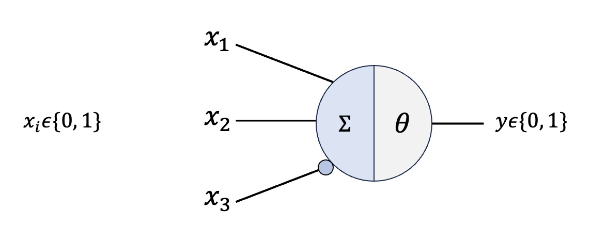
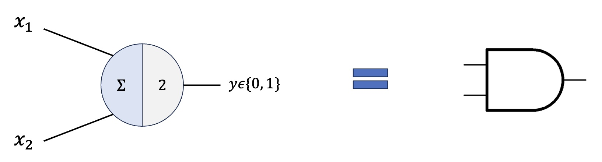
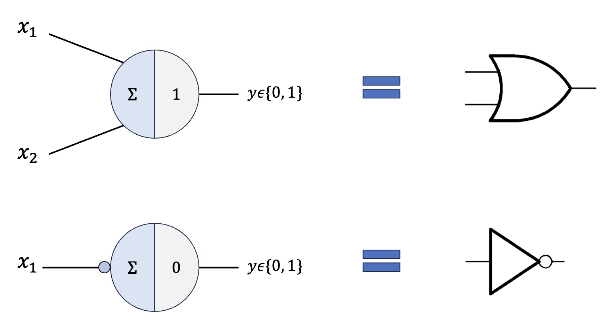

# Les réseaux de neurones

## Neurones de McCulloch et Pitts

McCulloch et Pitts (MP) furent les premiers à proposer un neurone artificiel (plus ou moins) inspiré par les neurones biologiques. La figure suivante montre un schéma du neurone de MP.

  

<strong>Figure 1 : le neurone de McCulloch et Pitts.</strong>

Les seules valeurs possibles en entrée sont binaires (c'est-à-dire 0 ou 1). Comme pour les neurones biologiques, ce neurone possède une entrée inhibitrice (identifiée par un petit cercle à l'extrémité de la connection). Les entrées $x_i$ reçues par le neurone sont simplement additionnées et comparées à une valeur seuil $\theta$, ce qui détermine la sortie qui est, elle aussi, binaire :

$$
y=
\begin{cases}
0 \iff \sum x_{i} < \theta\\
1 \iff \sum x_{i} \geq \theta
\end{cases}
$$

Malgré son étonnante simplicité, la structure imaginée par MP peut reproduire plusieurs opérations logiques comme, par exemple, l'opérateur «et».

  

<strong>Figure 2 : le neurone de McCulloch et Pitts et l'opérateur «et».</strong>

Sur la figure 2, la valeur de $\theta$ est fixée à $2$. Lorsque les valeurs d'entrées sont $(0, 0)$ ou $(0, 1)$, leur somme est inférieure à $\theta = 2$, ce qui provoque une sortie $y = 0$. Toutefois, lors que les entrées sont $(1, 1)$, leur somme est $2$ et le neurone produit une sortie égale à $1$, ce qui correspondant, en tout point, au comportement d'une porte logique «et».

  

<strong>Figure 3 : le neurone de McCulloch et Pitts et l'opérateur «ou» et «non».</strong>

La figure 3 montre deux autres exemples de portes logiques réalisées en fixant judicieusement la valeur de $\theta$, soit le «ou» et le «non». Notons finalement qu'il est possible de combiner les neurones ensembles de façon à ce que la sortie d'un premier serve d'entrée à un second, augmentant ainsi la richesse des structures construites avec ces neurones.

## Perceptron de Rosenblatt

Directement inspiré par les travaux de MP, le psychologue Rosenblatt imagine un nouveau type de neurone. Il retire l'entrée inhibitrice et rend possible les entrées de toutes valeurs ; de plus, il ajoute une pondération à chaque entrée qui multiplie cette dernière.

## Réseaux profonds

Si Rosenblatt avait imaginé accumuler des neurones sur plusieurs couches, il n'avait pas été en mesure d'élaborer une technique pour les entraîner.

## Exemple : chats et chiens

Un problème simple et classique pour illustrer le fonctionnement d'un réseau de neurones est le jeu de données chats et chiens.

## Représentation universelle

La propriété la plus importante d'un réseau profond est le théorème de représentation universelle.

### Références

Ananthaswamy, Anand (2024) Why Machines Learn: The Elegant Math Behind Modern AI

Rojas, Paul (1996) Neural Networks: A Systematic Introduction
